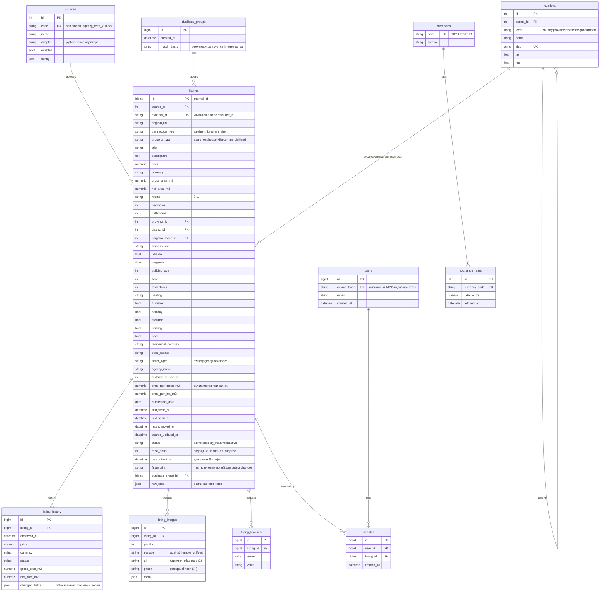
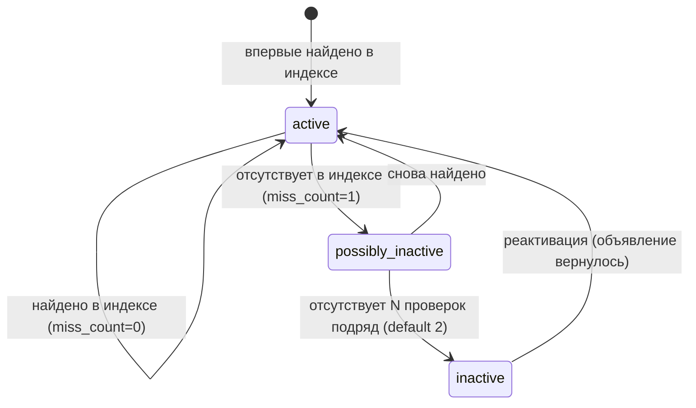

# TREstate — независимый агрегатор недвижимости Турции

## Архитектура системы

Продукт — **платформа данных о недвижимости**, а не парсер. Пользователь никогда не
взаимодействует с исходными порталами: все запросы обслуживаются нашей БД.

```
┌─────────────────────────────────────────────────────────────────┐
│  SOURCE ADAPTERS (плагины, единый интерфейс ListingSource)      │
│  sahibinden* | agency_feed (XML/CSV/JSON) | official APIs | ... │
└──────────────┬──────────────────────────────────────────────────┘
               ▼
        INGESTION PIPELINE          (инкрементальный diff, планировщик)
               ▼
        NORMALIZER                  (гео, комнатность, валюты, признаки)
               ▼
        POSTGRESQL                  (listings + history + raw_data JSONB)
               ▼
        SEARCH / ANALYTICS          (PG full-text + нормализованные колонки)
               ▼
        REST API (FastAPI)          (работает ТОЛЬКО с нашей БД)
               ▼
        FRONTEND (Next.js)          (собственный UI, независимый от источников)
```

`*` Адаптер Sahibinden — заглушка-контракт: активируется только при появлении
разрешённого канала данных (официальный API, лицензированный доступ, партнёрский
feed). Система **не** содержит и не будет содержать механизмов обхода
CAPTCHA/антибот-защиты/rate-limit. Если источник блокирует автоматический доступ —
данные для него получаются альтернативным разрешённым способом, и это меняет
только адаптер, не платформу.

### Ключевые принципы

1. **Мульти-source**: каждый источник — изолированный адаптер, реализующий
   `ListingSource`. Замена способа импорта (API → XML feed) не затрагивает ничего
   вне каталога адаптера.
2. **Пользовательский путь**: `USER → FRONTEND → API → DATABASE`. Ни одного
   обращения к внешним сайтам во время пользовательского запроса.
3. **Modular monolith**: один деплой, чёткие границы модулей
   (`sources / ingestion / normalization / services / api`). Микросервисы — только
   когда появится реальная необходимость.
4. **raw_data сохраняется всегда** (JSONB) — любую нормализацию можно перезапустить
   ретроспективно без повторного импорта.

## ER-схема



Поисковые поля — нормализованные колонки с индексами; JSONB — только для
`raw_data`, `changed_fields`, `config`, `meta`.

## Жизненный цикл объявления



Исчезновение подтверждается повторной проверкой — одиночный «пропуск» в индексе
никогда не приводит к немедленному `inactive`.

## Инкрементальное обновление (двухступенчатая схема)

```
1. adapter.fetch_index()  → множество {external_id, fingerprint?}
2. diff с БД:
      NEW      = index − db
      MISSING  = db(active|possibly_inactive) − index
      EXISTING = index ∩ db
      CHANGED  = EXISTING, где fingerprint отличается
                 ИЛИ next_check_at <= now (плановая перепроверка)
3. Полная загрузка (fetch_listing → normalize → upsert) — ТОЛЬКО для NEW и CHANGED.
4. MISSING → miss_count += 1 → переходы статусов (см. lifecycle).
5. Для всех найденных в индексе: last_seen_at = now, last_checked_at = now,
   next_check_at = адаптивный график.
```

### Адаптивный график перепроверки (конфигурируемый, `core/config.py`)

| Возраст объявления | Интервал проверки |
|---|---|
| 0–7 дней | 24 ч |
| 8–30 дней | 36 ч |
| 31–90 дней | 60 ч |
| 90+ дней | 96 ч |

Отдельно: аренда ~24 ч, продажа 24–48 ч (множитель на тип сделки в конфиге).
Полный snapshot не требуется — каждый цикл обрабатывает только дельту.

## История изменений

Любое изменение цены/статуса/площади при повторной обработке создаёт запись в
`listing_history` (плюс первичная запись при появлении). API отдаёт производные
метрики: первоначальная цена, текущая, абсолютное и процентное снижение, число
изменений, дата последнего изменения, дней в базе.

## Нормализация

Отдельный слой `app/normalization/`:
- **география**: `"MAHMUTLAR MAH." → Neighbourhood(Mahmutlar, Alanya, Antalya)` —
  словарь алиасов + türkçe-фолдинг (İ/ı/ş/ğ/ç/ö/ü), иерархия locations в БД;
- **комнатность**: `"2+1", "2 + 1", "2·1" → rooms="2+1", bedrooms=2`;
- **тип недвижимости / сделки / отопление / валюта** — mapping-таблицы;
- **price/m²**: gross и net считаются раздельно и не смешиваются;
- AI-extraction из свободного текста (позже) — только **дополняет** пустые поля,
  никогда не перезаписывает исходные данные.

## REST API (MVP)

```
GET    /api/listings                  — поиск с фильтрами, пагинация, сортировка
GET    /api/listings/{id}            — карточка + свежесть + price-аналитика
GET    /api/listings/{id}/history    — история цены/статуса
GET    /api/map                      — точки для карты (bbox-фильтр)
GET    /api/locations                — дерево географии для фильтров
GET    /api/meta                     — справочники (типы, валюты, курсы)
POST   /api/favorites                — добавить в избранное (X-Device-Id)
GET    /api/favorites                — список избранного
DELETE /api/favorites/{listing_id}   — удалить
```

Все ручки работают исключительно с нашей БД.

## Frontend flow (MVP)

```
/            поиск: фильтры (сделка, тип, гео, цена, m², комнаты, этаж,
             возраст, мебель/бассейн/парковка/балкон) + список карточек
/listing/[id]  карточка: цена, price/m² (gross и net), характеристики,
               история цены, «последняя проверка», статус, source-метаданные
/map         карта с точками (leaflet)
/favorites   избранное
```

Карточка показывает: `first_seen_at`, `last_checked_at`, дату последнего
изменения, статус — пользователь всегда видит свежесть данных.

## Стек

Python 3.12 · FastAPI · SQLAlchemy 2 · Alembic · PostgreSQL (dev/tests — SQLite) ·
Redis + APScheduler/Celery для фоновых задач (MVP — APScheduler в процессе) ·
S3-compatible storage для изображений · Next.js/React frontend.

## Дорожная карта MVP

1. **Этап 1 (готово в этом репозитории)**: модели, нормализация, ingestion с
   инкрементальным diff и lifecycle, история цен, поиск/фильтры, REST API,
   mock- и feed-адаптеры, тесты, минимальный frontend.
2. **Этап 2** (частично готово): PostgreSQL+Alembic в проде и docker-compose
   (db+api+worker) — готово; планировщик отдельным процессом
   (`python -m app.tasks.scheduler`) — готово; курсы валют из официального
   XML TCMB с fallback на сохранённые — готово. Осталось: реальный
   agency-feed (нужен договор с агентством), изображения в S3.
3. **Этап 3**: дедупликация с image phash/embeddings, переводы (ru/en/tr),
   AI-extraction, сохранённые поиски и уведомления, аналитика рынка.
